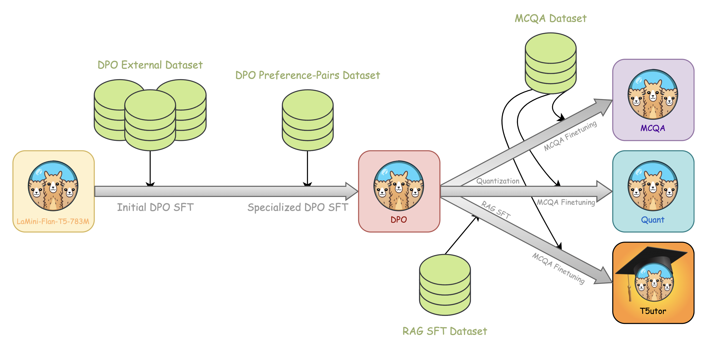

Background & Objectives
===

In this project, we have at our disposal numerous amounts of light-sheet zebrafish scans. Our aim is to segment these scans in a particular manner. The aim would be to highlight specific features of the zebrafish  through these segmentations (somites \& notochord, which we will look at later), and then potentially create 3D renderings of certain parts of the zebrafish embryo. The difficulty of this task is that the manual segmentation of these scans is often a extremely bothersome task, taking a significant amount of time per zebrafish scan.

Thus, the aim would be to automate this process, through the fine-tuning and usage of already existing state-of-the art segmentation models. Before diving into the machine learning (ML) models, we will first look at the process of manually segmenting these scans, in order to better understand the data that we have at our disposal, the expected segmentations as well as the difficulty of manually labeling the data for future ML tasks.

The main focus of this project will be to develop this automated process through one particular transformer model : Segment Anything Model (developed by Meta). We will be looking at how the model itself is structured, its benefits when it comes to our specific use-case as well as its limitations.

