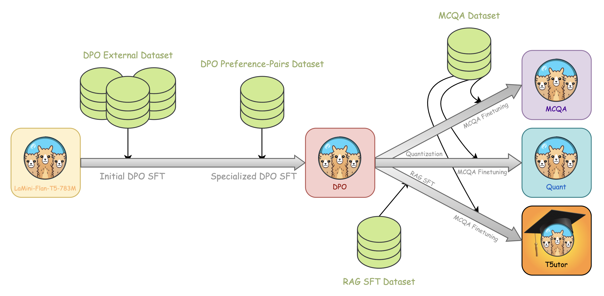

Abstract
===

LMs have a wide range of practical applications in the Education sector where they can improve the development of personalized teaching as well as provide tutoring for student communities lacking standard educational resources. We have built an educational assistant using Flan-T5 large, a modestly sized LM able to run on consumer hardware which students can use to assist them in question-answering tasks. To further increase its capabilities we have incorporated RAG to leverage a large knowledge database as well as used 4-bit quantization to build a more memory-efficient model, which is crucial to effectively democratizing LLMs access. Model quantization leads to a 68% reduction in memory footprint without severely impacting performance remaining at 32% accuracy. Furthermore, our flagship model T5utor using RAG increased performance by 4 4% with respect to our MCQA model. After our training pipelines some of the models reach higher accuracies on common benchmarks w.r.t. the reference model.

